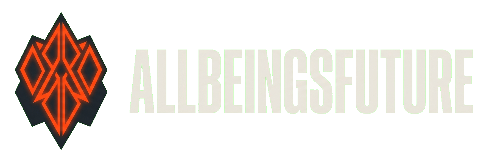
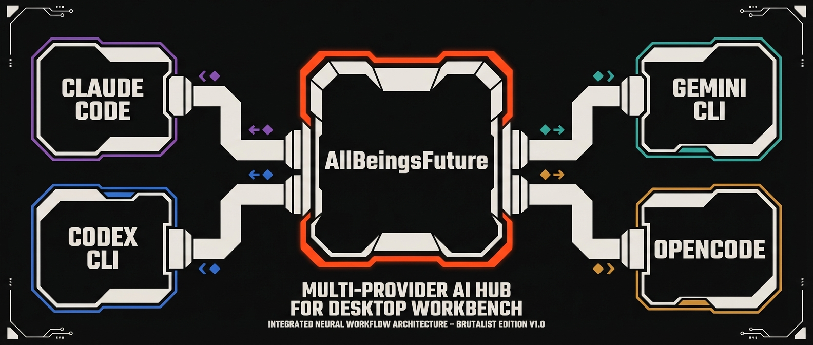
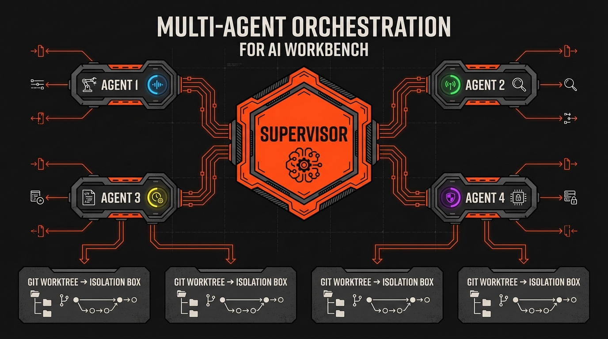
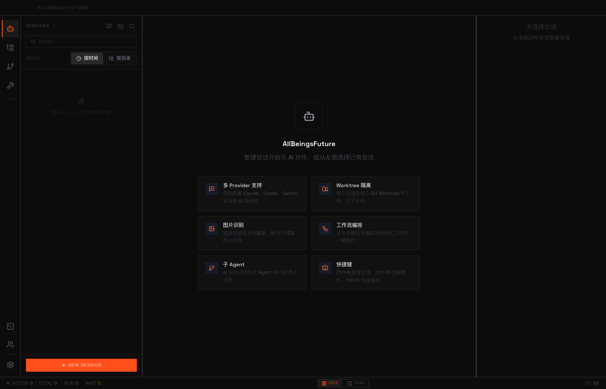
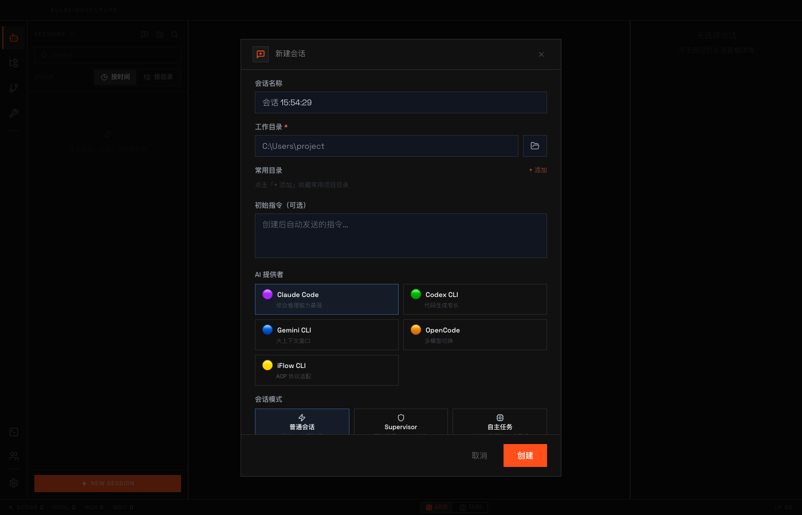
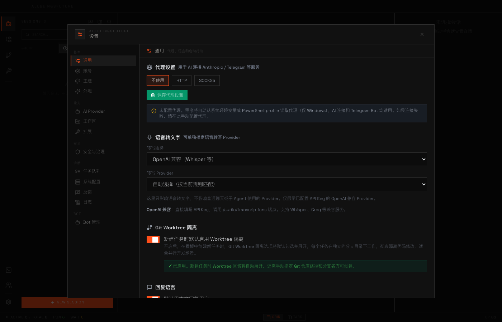

**中文** | [English](./README.md)

<div align="center">


# AllBeingsFuture
**多 AI 并行协作的指挥中心**

[](LICENSE)
[](https://electronjs.org)
[](https://github.com/AllBeingsFuture/AllBeingsFuture/releases)
[](https://reactjs.org)

[功能特性](#-功能特性) · [工作原理](#-工作原理) · [快速开始](#-快速开始) · [技术栈](#-技术栈) · [English](./README.md)
</div>

---

**AllBeingsFuture** 是一款*桌面 AI 工作台*，将 Claude、Codex、Gemini 和 OpenCode 整合在同一界面，并让它们并行运作。创建一个 Supervisor Agent，自动分解复杂任务、将子任务分派给独立 Git Worktree 中的各个 Agent，协调汇总结果——全程无需离开一个窗口。内置 72 个技能模板，覆盖代码审查到 PDF 处理的全场景，是严肃 AI 辅助开发的核心操作台。

## ✨ 功能特性

- **5 大 AI Provider 统一管理** — Claude Code、Codex CLI、Gemini CLI、OpenCode、iFlow CLI，随时切换或同时运行
- **Supervisor 编排模式** — 一个主 Agent 自动拆解任务、派生并协调多个子 Agent 并行完成
- **Git Worktree 隔离** — 每个 Agent 在独立分支中工作，零冲突、零文件污染
- **72 个内置技能** — 代码审查、PPT/PDF/Excel 生成、图片理解、翻译、网页抓取、B站工具等
- **MCP 协议扩展** — 内置 Agent Control、Web Search、Chrome DevTools，支持自定义 MCP Server
- **内置终端** — 基于 xterm.js + node-pty 的完整集成终端
- **Token 用量仪表盘** — 跨所有 Provider 和会话的实时用量追踪
- **策略引擎** — 审计日志、访问控制与团队治理
- **Bot 管理** — 直接在工作台连接和管理 IM 机器人（Telegram 等）
- **任务队列** — 后台任务管理与状态监控

## 🖼 工作原理

### 阶段一 — 接入 AI Provider

<div align="center"></div>

1. 启动 AllBeingsFuture，进入**设置 → AI Provider**
2. 为 Claude、Codex、Gemini、OpenCode 或 iFlow 配置 API Key 或 CLI 路径
3. 每个会话选择一个 Provider，或由 Supervisor 根据任务类型自动选择
4. Provider 独立运行，切换时不丢失会话上下文

### 阶段二 — 多 Agent 并行编排

<div align="center"></div>

1. 以 **Supervisor** 模式创建会话
2. 描述高层目标，Supervisor 自动将其分解为子任务
3. 子 Agent 自动生成，每个在独立 **Git Worktree** 中工作
4. 并行推进，Supervisor 汇总并协调各 Agent 的结果
5. 在左侧会话面板实时监控所有 Agent 状态

## 📸 界面截图

<div align="center">


*主工作区 — 粗野主义暗色界面，包含会话侧边栏、多 Provider 功能卡片与实时状态栏*
</div>

<br />

<div align="center">


*新建会话 — 选择 AI Provider、工作目录和会话模式（普通 / Supervisor / 自主任务）*
</div>

<br />

<div align="center">


*设置面板 — 代理配置、语音转文字、Git Worktree 隔离及系统级参数*
</div>

## 🚀 快速开始

**前提条件：** [Node.js 22+](https://nodejs.org/)

```bash
# 克隆并安装依赖
git clone https://github.com/AllBeingsFuture/AllBeingsFuture.git
cd AllBeingsFuture
npm install

# 开发模式（热重载）
npm run dev

# 生产构建
npm run build

# 打包 Windows 安装包
npm run pack

# 打包 macOS DMG（arm64 + x64）
npm run pack:mac
```

> **macOS 提示：** 首次启动可能提示"无法验证开发者"，前往**系统设置 → 隐私与安全性 → 仍要打开**即可。

## 🛠 技术栈

| 层级 | 技术 |
|------|------|
| 桌面 | Electron 33（Main + Renderer 双进程） |
| 前端 | React 18 · TypeScript 5.7 · Vite 6 · Zustand 5 · TailwindCSS 3 |
| 后端 | better-sqlite3 · node-pty · Claude Agent SDK |
| AI Provider | Claude Code · Codex CLI · Gemini CLI · OpenCode · iFlow CLI |
| MCP Server | Agent Control · Web Search · Chrome DevTools |
| 构建 | electron-builder → NSIS（Windows）· DMG（macOS） |

## 📁 项目结构

```
electron/
├── main.ts              # 入口：窗口、IPC、SQLite、系统托盘
├── bridge/adapters/     # Claude / Codex / Gemini / OpenCode 适配器
├── parser/              # CLI 输出解析引擎
├── services/            # 45 个服务模块（~9000+ LOC）
└── ipc/handlers.ts      # 50+ IPC channel 路由

frontend/src/
├── stores/              # 30+ Zustand store
├── components/          # UI 组件
└── hooks/               # 自定义 Hooks

mcps/                    # MCP Server（Agent Control、Web Search、Chrome DevTools）
skills/                  # 72 个内置技能模板
```

## 🤝 贡献

欢迎提交 Pull Request。查看 Issue 列表或发起讨论。

---

## 📜 许可证

[BSD 3-Clause](LICENSE) 开源协议。

## 🔗 链接

- [LINUX DO 社区](https://linux.do/)
